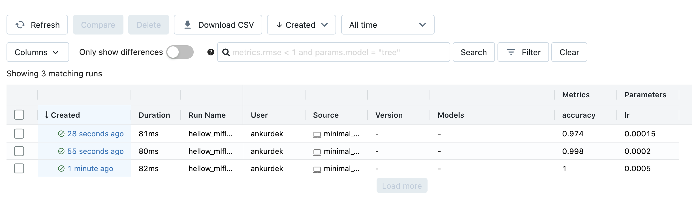
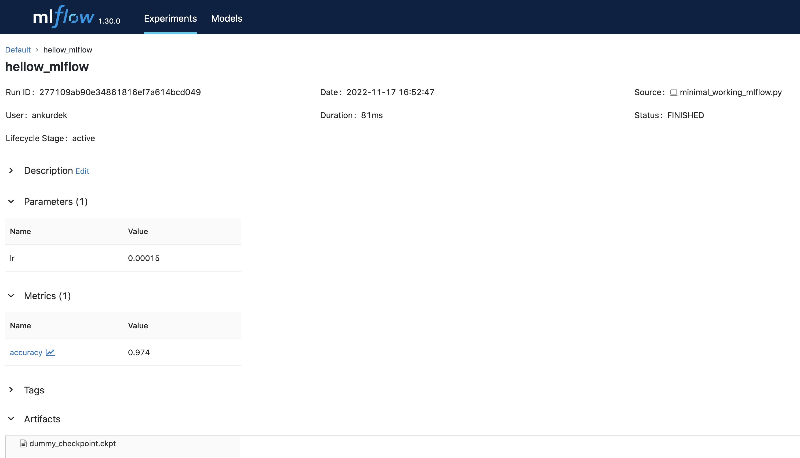
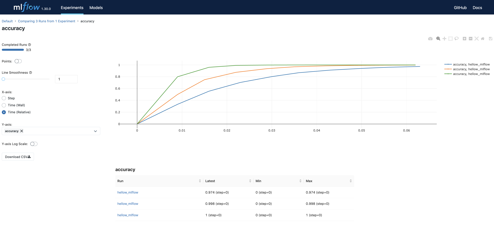

# Minimal working example to get started with MLFlow
Use this as a reference to track your ML trainings

```
import mlflow
import os

with mlflow.start_run(run_name="hellow_mlflow"):
    # log any parameter like learning rate (any number)
    lr = 1.5e-4
    mlflow.log_param("lr", lr)

    # training epochs
    for e in range(10):
        # log metrics over time (any number)
        dummy_accuracy = 1 - 1 / ((1e4 * lr)**e)
        mlflow.log_metric("accuracy", dummy_accuracy)

        # log checkpoint as artifact (artifact is any file or directory)
        os.system("echo I am a dummy checkpoint > dummy_checkpoint.ckpt")
        mlflow.log_artifact("dummy_checkpoint.ckpt")
```


## Installation

```
pip install mlflow
```

## Run a dummy training
```
python minimal_working_mlflow.py
```
You can run the above command multiple times. Each time, a new run is created inside `mlruns` directory.

## Visualize runs
```
mlflow ui
```
Terminal will show link to open dashboard (most likely [http://127.0.0.1:5000`](http://127.0.0.1:5000)). Open the link.


Click on any run to view it.



Let's say you wan to plot the training plots (accuracy over epoch) for the different runs. You can compare multiple experiments by selecting them and clicking compare. Then click on accuracy under metrics.



